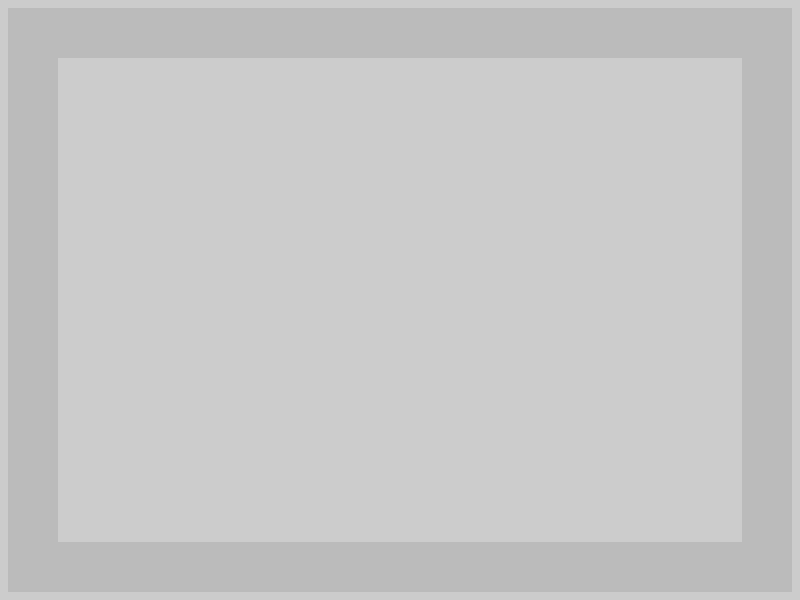
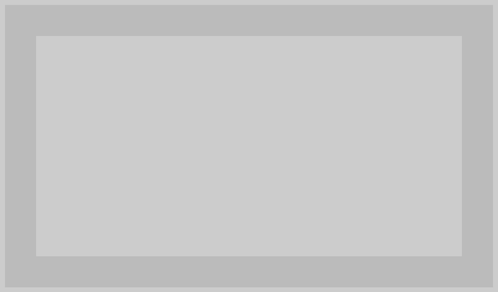
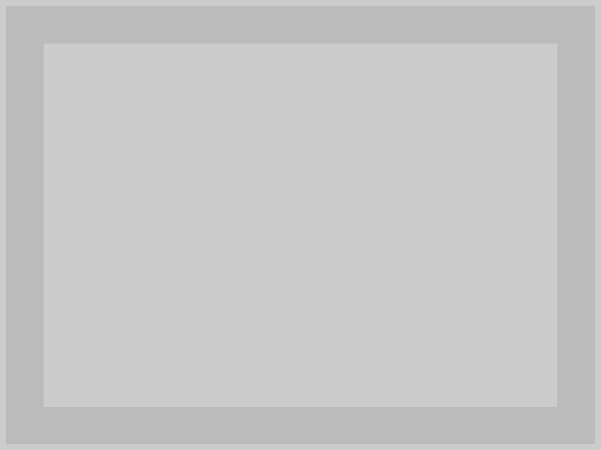
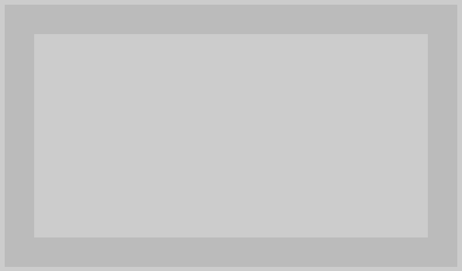
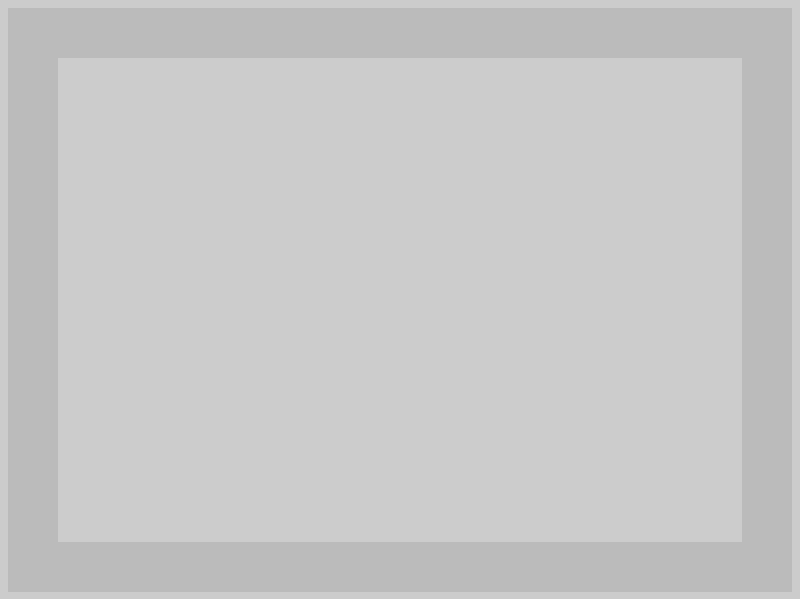

# testcafe-browser-provider-selenium-repro-screenshot

This repository reproduces issues with screenshots in [testcafe-browser-provider-selenium](https://github.com/alexschwantes/testcafe-browser-provider-selenium).

The package provides npm scripts to test browsers and platforms.

`npm run install:oldchrome` uses [@puppeteer/browsers](https://www.npmjs.com/package/@puppeteer/browsers) to download `chrome@113`.
This is the simplest way to obtain an older browser.
Unfortunately this is [the oldest we currently get](https://github.com/GoogleChromeLabs/chrome-for-testing?tab=readme-ov-file#json-api-endpoints).
This repository was created in windows.
Except for the tests with `chromeold`, the repo should work fine on all platforms.

The scripts that start with `browsertools` don't run selenium:

* `npm run browsertools:chrome`
* `npm run browsertools:chrome#headless`
* `npm run browsertools:oldchrome`
* `npm run browsertools:oldchrome#headless`
* `npm run browsertools:safari` - use this when you're on a mac - for comparison

I have a macOS machine that runs a selenium server.
The URL ist configured in `[package.json].config.testcafe_browser_provider_selenium_repro_screenshot.macos_server`
(npm scripts use this to set the `SELENIUM_SERVER` variable)

* `npm run macos:safari`
* ~~`npm run macos:safari#headless`~~ [there is no headless safari](https://discussions.apple.com/thread/251837694?sortBy=best)
* `npm run macos:chrome`
* `npm run macos:chrome#headless`

I have a windows machine that runs a selenium server.
The URL ist configured in `[package.json].config.testcafe_browser_provider_selenium_repro_screenshot.windows_server`
(npm scripts use this to set the `SELENIUM_SERVER` variable)

* `npm run windows:chrome`
* `npm run windows:chrome#headless`
* `npm run windows:oldchrome`
* `npm run windows:oldchrome#headless`
* `npm run windows:firefox`
* `npm run windows:firefox#headless`

## Results

### √√√ `npm run browsertools:chrome`



```txt
> npm run browsertools:chrome

> testcafe-browser-provider-selenium-repro-screenshot@1.0.0 browsertools:chrome
> testcafe chrome test.tc.ts

 Running tests in:
 - Chrome 122.0.0.0 / Windows 10

 screenshot
 √ set screen size
 √ set screen size (userland)
 √ screenshot size (screenshots:
 C:\Dev\github.com\htho\testcafe-browser-provider-selenium-repro-screenshot\screenshots\browsertools_chrome--screenshot_size.png)


 3 passed (10s)
```

### √√√ `npm run browsertools:chrome#headless`


```txt
> npm run browsertools:chrome#headless

> testcafe-browser-provider-selenium-repro-screenshot@1.0.0 browsertools:chrome#headless
> testcafe chrome:headless test.tc.ts

 Running tests in:
 - Chrome 122.0.6261.112 / Windows 10

 screenshot
 √ set screen size
 √ set screen size (userland)
 √ screenshot size (screenshots:
 C:\Dev\github.com\htho\testcafe-browser-provider-selenium-repro-screenshot\screenshots\browsertools_chrome_headless--screenshot_size.png)


 3 passed (8s)
```

### √√√ `npm run browsertools:firefox`


```txt
> npm run browsertools:firefox

> testcafe-browser-provider-selenium-repro-screenshot@1.0.0 browsertools:firefox
> testcafe firefox test.tc.ts

 Running tests in:
 - Firefox 123.0 / Windows 10

 screenshot
 √ set screen size
 √ set screen size (userland)
 √ screenshot size (screenshots:
 C:\Dev\github.com\htho\testcafe-browser-provider-selenium-repro-screenshot\screenshots\browsertools_firefox--screenshot_size.png)


 3 passed (10s)
```

### √√√ `npm run browsertools:firefox#headless`


```txt
> npm run browsertools:firefox#headless

> testcafe-browser-provider-selenium-repro-screenshot@1.0.0 browsertools:firefox#headless
> testcafe firefox:headless test.tc.ts

 Running tests in:
 - Firefox 123.0 / Windows 10

 screenshot
 √ set screen size
 √ set screen size (userland)
 √ screenshot size (screenshots:
 C:\Dev\github.com\htho\testcafe-browser-provider-selenium-repro-screenshot\screenshots\browsertools_firefox_headless--screenshot_size.png)


 3 passed (10s)
```

### √√√ `npm run browsertools:oldchrome`


```txt
> npm run browsertools:oldchrome

> testcafe-browser-provider-selenium-repro-screenshot@1.0.0 browsertools:oldchrome 
> testcafe "chrome:./chrome/win64-113.0.5672.63/chrome-win64/chrome.exe" test.tc.ts

 Running tests in:
 - Chrome 113.0.0.0 / Windows 10

 screenshot
 √ set screen size
 √ set screen size (userland)
 √ screenshot size (screenshots:
 C:\Dev\github.com\htho\testcafe-browser-provider-selenium-repro-screenshot\screenshots\browsertools_oldchrome--screenshot_size.png)


 3 passed (10s)
```

### √√√ `npm run browsertools:oldchrome#headless`


```txt
> npm run browsertools:oldchrome#headless

> testcafe-browser-provider-selenium-repro-screenshot@1.0.0 browsertools:oldchrome#headless
> testcafe "chrome:./chrome/win64-113.0.5672.63/chrome-win64/chrome.exe:headless" test.tc.ts

 Running tests in:
 - Chrome 113.0.5672.63 / Windows 10

 screenshot
 √ set screen size
 √ set screen size (userland)
 √ screenshot size (screenshots:
 C:\Dev\github.com\htho\testcafe-browser-provider-selenium-repro-screenshot\screenshots\browsertools_oldchrome_headless--screenshot_size.png)


 3 passed (8s)
```

### ??? `npm run browsertools:safari` - use this when you're on a mac - for comparison

### ×√√! `npm run macos:safari`


* The screenshot has rounded corners, added by macOS
* There is TestCafes screenshot mark in the bottom right corner - beacuse testcafe was not able to find the mark - probably because it is cut-off by the rounded corner
* The sceenshot is twice as big as the windows screenshots because of the retina display

```txt
> npm run macos:safari

> testcafe-browser-provider-selenium-repro-screenshot@1.0.0 macos:safari
> cross-env SELENIUM_SERVER=$npm_package_config_testcafe_browser_provider_selenium_repro_screenshot_macos_server testcafe selenium:safari test.tc.ts

 Running tests in:
 - Safari 17.3.1 / macOS 10.15.7

 screenshot
 × set screen size

   1) AssertionError: Height not properly set to targetHeight!: expected 548 to deeply equal 600

      + expected - actual

      -548
      +600


      Browser: Safari 17.3.1 / macOS 10.15.7

         28 |    await t.expect(getWindowInnerHeight()).notEql(targetHeight, "Height not expected to be targetHeight yet!");
         29 |
         30 |    await t.resizeWindow(targetWidth, targetHeight);
         31 |
         32 |    await t.expect(getWindowInnerWidth()).eql(targetWidth, "Width not properly set to targetWidth!");
       > 33 |    await t.expect(getWindowInnerHeight()).eql(targetHeight, "Height not properly set to targetHeight!");
         34 |});
         35 |
         36 |test("set screen size (userland)", async t => {
         38 |    await t.expect(getWindowInnerHeight()).notEql(targetHeight, "Height not expected to be targetHeight yet!");

         at <anonymous> (C:\Dev\github.com\htho\testcafe-browser-provider-selenium-repro-screenshot\test.tc.ts:33:44)
         at fulfilled (C:\Dev\github.com\htho\testcafe-browser-provider-selenium-repro-screenshot\test.tc.ts:5:58)


 √ set screen size (userland)
 √ screenshot size (screenshots: C:\Dev\github.com\htho\testcafe-browser-provider-selenium-repro-screenshot\screenshots\macos_safari--screenshot_size.png)      


 1/3 failed (23s)

 Warnings (1):
 --
  Unable to locate the page area in the browser window screenshot at
  C:\Dev\github.com\htho\testcafe-browser-provider-selenium-repro-screenshot\screenshots\macos_safari--screenshot_size.png, because the page area mark with ID  
  2000721313 is not found in the screenshot.
```

### ! ~~`npm run macos:safari#headless`~~ [there is no headless safari](https://discussions.apple.com/thread/251837694?sortBy=best)

```txt
> npm run macos:safari#headless

> testcafe-browser-provider-selenium-repro-screenshot@1.0.0 macos:safari#headless
> echo THERE IS NO HEADLESS SAFARI!: https://discussions.apple.com/thread/251837694?sortBy=best

THERE IS NO HEADLESS SAFARI!: https://discussions.apple.com/thread/251837694?sortBy=best
```

### ×√× `npm run macos:chrome`



```txt
> npm run macos:chrome

> testcafe-browser-provider-selenium-repro-screenshot@1.0.0 macos:chrome
> cross-env SELENIUM_SERVER=$npm_package_config_testcafe_browser_provider_selenium_repro_screenshot_macos_server testcafe selenium:chrome test.tc.ts

 Running tests in:
 - Chrome 122.0.0.0 / macOS 10.15.7

 screenshot
 × set screen size

   1) AssertionError: Height not properly set to targetHeight!: expected 471 to deeply equal 600

      + expected - actual

      -471
      +600


      Browser: Chrome 122.0.0.0 / macOS 10.15.7

         28 |    await t.expect(getWindowInnerHeight()).notEql(targetHeight, "Height not expected to be targetHeight yet!");
         29 |
         30 |    await t.resizeWindow(targetWidth, targetHeight);
         31 |
         32 |    await t.expect(getWindowInnerWidth()).eql(targetWidth, "Width not properly set to targetWidth!");
       > 33 |    await t.expect(getWindowInnerHeight()).eql(targetHeight, "Height not properly set to targetHeight!");
         34 |});
         35 |
         36 |test("set screen size (userland)", async t => {
         37 |    await t.expect(getWindowInnerWidth()).notEql(targetWidth, "Width not expected to be targetWidth yet!");
         38 |    await t.expect(getWindowInnerHeight()).notEql(targetHeight, "Height not expected to be targetHeight yet!");

         at <anonymous> (C:\Dev\github.com\htho\testcafe-browser-provider-selenium-repro-screenshot\test.tc.ts:33:44)
         at fulfilled (C:\Dev\github.com\htho\testcafe-browser-provider-selenium-repro-screenshot\test.tc.ts:5:58)


 √ set screen size (userland)
 × screenshot size (screenshots: C:\Dev\github.com\htho\testcafe-browser-provider-selenium-repro-screenshot\screenshots\macos_chrome--screenshot_size.png)

   1) AssertionError: Screenshot does not have the same heigt as the window!: expected 941 to deeply equal 942

      + expected - actual

      -941
      +942


      Browser: Chrome 122.0.0.0 / macOS 10.15.7

         63 |    const expectedWidth = newWidth * devicePixelRatio;
         64 |    const expectedHeight = newHeight * devicePixelRatio;
         65 |
         66 |    const png = PNG.sync.read(readFileSync(joinPath("screenshots", `${screenshotPath}.png`)));
         67 |    await t.expect(png.width).eql(expectedWidth, "Screenshot does not have the same width as the window!");
       > 68 |    await t.expect(png.height).eql(expectedHeight, "Screenshot does not have the same heigt as the window!");
         69 |});
         70 |

         at <anonymous> (C:\Dev\github.com\htho\testcafe-browser-provider-selenium-repro-screenshot\test.tc.ts:68:32)
         at fulfilled (C:\Dev\github.com\htho\testcafe-browser-provider-selenium-repro-screenshot\test.tc.ts:5:58)


 2/3 failed (14s)
```

### √√× `npm run macos:chrome#headless`



```txt
> npm run macos:chrome#headless

> testcafe-browser-provider-selenium-repro-screenshot@1.0.0 macos:chrome#headless
> cross-env SELENIUM_SERVER=$npm_package_config_testcafe_browser_provider_selenium_repro_screenshot_macos_server testcafe selenium:chrome#headless test.tc.ts   

 Running tests in:
 - Chrome 122.0.6261.112 / macOS 10.15.7

 screenshot
 √ set screen size
 √ set screen size (userland)
 × screenshot size (screenshots:
 C:\Dev\github.com\htho\testcafe-browser-provider-selenium-repro-screenshot\screenshots\macos_chrome_headless--screenshot_size.png)

   1) AssertionError: Screenshot does not have the same heigt as the window!: expected 1199 to deeply equal 1200

      + expected - actual

      -1199
      +1200


      Browser: Chrome 122.0.6261.112 / macOS 10.15.7

         63 |    const expectedWidth = newWidth * devicePixelRatio;
         64 |    const expectedHeight = newHeight * devicePixelRatio;
         65 |
         66 |    const png = PNG.sync.read(readFileSync(joinPath("screenshots", `${screenshotPath}.png`)));
         67 |    await t.expect(png.width).eql(expectedWidth, "Screenshot does not have the same width as the window!");
       > 68 |    await t.expect(png.height).eql(expectedHeight, "Screenshot does not have the same heigt as the window!");
         69 |});
         70 |

         at <anonymous> (C:\Dev\github.com\htho\testcafe-browser-provider-selenium-repro-screenshot\test.tc.ts:68:32)
         at fulfilled (C:\Dev\github.com\htho\testcafe-browser-provider-selenium-repro-screenshot\test.tc.ts:5:58)


 1/3 failed (11s)
```

### ×√× `npm run windows:chrome`



```txt
> npm run windows:chrome

> testcafe-browser-provider-selenium-repro-screenshot@1.0.0 windows:chrome
> cross-env SELENIUM_SERVER=$npm_package_config_testcafe_browser_provider_selenium_repro_screenshot_windows_server testcafe selenium:chrome test.tc.ts

 Running tests in:
 - Chrome 122.0.0.0 / Windows 10

 screenshot
 × set screen size

   1) AssertionError: Width not properly set to targetWidth!: expected 784 to deeply equal 800

      + expected - actual

      -784
      +800


      Browser: Chrome 122.0.0.0 / Windows 10

         27 |    await t.expect(getWindowInnerWidth()).notEql(targetWidth, "Width not expected to be targetWidth yet!");
         28 |    await t.expect(getWindowInnerHeight()).notEql(targetHeight, "Height not expected to be targetHeight yet!");
         29 |
         30 |    await t.resizeWindow(targetWidth, targetHeight);
         31 |
       > 32 |    await t.expect(getWindowInnerWidth()).eql(targetWidth, "Width not properly set to targetWidth!");
         33 |    await t.expect(getWindowInnerHeight()).eql(targetHeight, "Height not properly set to targetHeight!");
         34 |});
         35 |
         36 |test("set screen size (userland)", async t => {
         37 |    await t.expect(getWindowInnerWidth()).notEql(targetWidth, "Width not expected to be targetWidth yet!");

         at <anonymous> (C:\Dev\github.com\htho\testcafe-browser-provider-selenium-repro-screenshot\test.tc.ts:32:43)
         at fulfilled (C:\Dev\github.com\htho\testcafe-browser-provider-selenium-repro-screenshot\test.tc.ts:5:58)


 √ set screen size (userland)
 × screenshot size (screenshots: C:\Dev\github.com\htho\testcafe-browser-provider-selenium-repro-screenshot\screenshots\windows_chrome--screenshot_size.png)

   1) AssertionError: Screenshot does not have the same heigt as the window!: expected 461 to deeply equal 462

      + expected - actual

      -461
      +462


      Browser: Chrome 122.0.0.0 / Windows 10

         63 |    const expectedWidth = newWidth * devicePixelRatio;
         64 |    const expectedHeight = newHeight * devicePixelRatio;
         65 |
         66 |    const png = PNG.sync.read(readFileSync(joinPath("screenshots", `${screenshotPath}.png`)));
         67 |    await t.expect(png.width).eql(expectedWidth, "Screenshot does not have the same width as the window!");
       > 68 |    await t.expect(png.height).eql(expectedHeight, "Screenshot does not have the same heigt as the window!");
         69 |});
         70 |

         at <anonymous> (C:\Dev\github.com\htho\testcafe-browser-provider-selenium-repro-screenshot\test.tc.ts:68:32)
         at fulfilled (C:\Dev\github.com\htho\testcafe-browser-provider-selenium-repro-screenshot\test.tc.ts:5:58)


 2/3 failed (17s)
```

### √√× `npm run windows:chrome#headless`



```txt
> npm run windows:chrome#headless

> testcafe-browser-provider-selenium-repro-screenshot@1.0.0 windows:chrome#headless
> cross-env SELENIUM_SERVER=$npm_package_config_testcafe_browser_provider_selenium_repro_screenshot_windows_server testcafe selenium:chrome#headless test.tc.ts 

 Running tests in:
 - Chrome 122.0.6261.112 / Windows 10

 screenshot
 √ set screen size
 √ set screen size (userland)
 × screenshot size (screenshots:
 C:\Dev\github.com\htho\testcafe-browser-provider-selenium-repro-screenshot\screenshots\windows_chrome_headless--screenshot_size.png)

   1) AssertionError: Screenshot does not have the same heigt as the window!: expected 599 to deeply equal 600

      + expected - actual

      -599
      +600


      Browser: Chrome 122.0.6261.112 / Windows 10

         63 |    const expectedWidth = newWidth * devicePixelRatio;
         64 |    const expectedHeight = newHeight * devicePixelRatio;
         65 |
         66 |    const png = PNG.sync.read(readFileSync(joinPath("screenshots", `${screenshotPath}.png`)));
         67 |    await t.expect(png.width).eql(expectedWidth, "Screenshot does not have the same width as the window!");
       > 68 |    await t.expect(png.height).eql(expectedHeight, "Screenshot does not have the same heigt as the window!");
         69 |});
         70 |

         at <anonymous> (C:\Dev\github.com\htho\testcafe-browser-provider-selenium-repro-screenshot\test.tc.ts:68:32)
         at fulfilled (C:\Dev\github.com\htho\testcafe-browser-provider-selenium-repro-screenshot\test.tc.ts:5:58)


 1/3 failed (14s)
```

### `npm run windows:oldchrome` TODO


```txt
```

### `npm run windows:oldchrome#headless` TODO


```txt
```

### ×√× `npm run windows:firefox`


```txt
> npm run windows:firefox        

> testcafe-browser-provider-selenium-repro-screenshot@1.0.0 windows:firefox
> cross-env SELENIUM_SERVER=$npm_package_config_testcafe_browser_provider_selenium_repro_screenshot_windows_server testcafe selenium:firefox test.tc.ts

 Running tests in:
 - Firefox 123.0 / Windows 10

 screenshot
 × set screen size

   1) AssertionError: Width not properly set to targetWidth!: expected 788 to deeply equal 800

      + expected - actual

      -788
      +800


      Browser: Firefox 123.0 / Windows 10

         27 |    await t.expect(getWindowInnerWidth()).notEql(targetWidth, "Width not expected to be targetWidth yet!");
         28 |    await t.expect(getWindowInnerHeight()).notEql(targetHeight, "Height not expected to be targetHeight yet!");
         29 |
         30 |    await t.resizeWindow(targetWidth, targetHeight);
         31 |
       > 32 |    await t.expect(getWindowInnerWidth()).eql(targetWidth, "Width not properly set to targetWidth!");
         33 |    await t.expect(getWindowInnerHeight()).eql(targetHeight, "Height not properly set to targetHeight!");
         34 |});
         35 |
         36 |test("set screen size (userland)", async t => {
         37 |    await t.expect(getWindowInnerWidth()).notEql(targetWidth, "Width not expected to be targetWidth yet!");

         at <anonymous> (C:\Dev\github.com\htho\testcafe-browser-provider-selenium-repro-screenshot\test.tc.ts:32:43)
         at fulfilled (C:\Dev\github.com\htho\testcafe-browser-provider-selenium-repro-screenshot\test.tc.ts:5:58)


 √ set screen size (userland)
 × screenshot size (screenshots: C:\Dev\github.com\htho\testcafe-browser-provider-selenium-repro-screenshot\screenshots\windows_firefox--screenshot_size.png)

   1) AssertionError: Screenshot does not have the same heigt as the window!: expected 508 to deeply equal 509

      + expected - actual

      -508
      +509

      Browser: Firefox 123.0 / Windows 10

         63 |    const expectedWidth = newWidth * devicePixelRatio;
         64 |    const expectedHeight = newHeight * devicePixelRatio;
         65 |
         66 |    const png = PNG.sync.read(readFileSync(joinPath("screenshots", `${screenshotPath}.png`)));
         67 |    await t.expect(png.width).eql(expectedWidth, "Screenshot does not have the same width as the window!");
       > 68 |    await t.expect(png.height).eql(expectedHeight, "Screenshot does not have the same heigt as the window!");
         69 |});
         70 |

         at <anonymous> (C:\Dev\github.com\htho\testcafe-browser-provider-selenium-repro-screenshot\test.tc.ts:68:32)
         at fulfilled (C:\Dev\github.com\htho\testcafe-browser-provider-selenium-repro-screenshot\test.tc.ts:5:58)


 2/3 failed (18s)
```

### √√× `npm run windows:firefox#headless`


```txt
> npm run windows:firefox#headless

> testcafe-browser-provider-selenium-repro-screenshot@1.0.0 windows:firefox#headless
> cross-env SELENIUM_SERVER=$npm_package_config_testcafe_browser_provider_selenium_repro_screenshot_windows_server testcafe selenium:firefox#headless test.tc.ts
 Running tests in:
 - Firefox 123.0 / Windows 10

 screenshot
 × set screen size

   1) AssertionError: Height not properly set to targetHeight!: expected 515 to deeply equal 600

      + expected - actual

      -515
      +600


      Browser: Firefox 123.0 / Windows 10

         28 |    await t.expect(getWindowInnerHeight()).notEql(targetHeight, "Height not expected to be targetHeight yet!");
         29 |
         30 |    await t.resizeWindow(targetWidth, targetHeight);
         31 |
         32 |    await t.expect(getWindowInnerWidth()).eql(targetWidth, "Width not properly set to targetWidth!");
       > 33 |    await t.expect(getWindowInnerHeight()).eql(targetHeight, "Height not properly set to targetHeight!");
         34 |});
         35 |
         36 |test("set screen size (userland)", async t => {
         37 |    await t.expect(getWindowInnerWidth()).notEql(targetWidth, "Width not expected to be targetWidth yet!");
         38 |    await t.expect(getWindowInnerHeight()).notEql(targetHeight, "Height not expected to be targetHeight yet!");

         at <anonymous> (C:\Dev\github.com\htho\testcafe-browser-provider-selenium-repro-screenshot\test.tc.ts:33:44)
         at fulfilled (C:\Dev\github.com\htho\testcafe-browser-provider-selenium-repro-screenshot\test.tc.ts:5:58)


 √ set screen size (userland)
 × screenshot size (screenshots:
 C:\Dev\github.com\htho\testcafe-browser-provider-selenium-repro-screenshot\screenshots\windows_firefox_headless--screenshot_size.png)

   1) AssertionError: Screenshot does not have the same heigt as the window!: expected 514 to deeply equal 515

      + expected - actual

      -514
      +515


      Browser: Firefox 123.0 / Windows 10

         63 |    const expectedWidth = newWidth * devicePixelRatio;
         64 |    const expectedHeight = newHeight * devicePixelRatio;
         65 |
         66 |    const png = PNG.sync.read(readFileSync(joinPath("screenshots", `${screenshotPath}.png`)));
         67 |    await t.expect(png.width).eql(expectedWidth, "Screenshot does not have the same width as the window!");
       > 68 |    await t.expect(png.height).eql(expectedHeight, "Screenshot does not have the same heigt as the window!");
         69 |});
         70 |

         at <anonymous> (C:\Dev\github.com\htho\testcafe-browser-provider-selenium-repro-screenshot\test.tc.ts:68:32)
         at fulfilled (C:\Dev\github.com\htho\testcafe-browser-provider-selenium-repro-screenshot\test.tc.ts:5:58)


 2/3 failed (18s)
```
